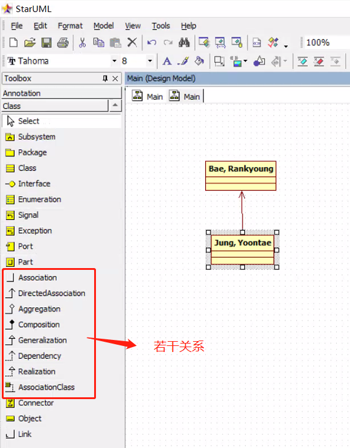

### 为啥要学 UML 和 类关系?

**UML** *Unified Modeling Language*：统一建模语言

了解和熟悉 Java 类之间可能存在的关系，有助于更好的理解类如何组织，如何进行业务模型编排。

学习 UML 有助于使用这种工具来辅助工作，特别是遇到复杂系统设计与构建时候，尤其必要。

#### 从下面这张图里，找找总共有多少种关系

#### Java 类 8 种关系介绍

1. Association 关联  
   解析：两个类以任何形式互相连接，称互相有联系 （实线连接）
   备注：从某种角度说，世间万物都是关联的，但在设计系统的设定边界内，定义恰当的关联关系，有助于对系统的理解和规划。  
   案例：Bank 和 Account 存在 Register 的关联关系  
   
2. Directed Association / Dependency 定向关联  
   解析：类之间的关联是双向的，可以用箭头表示包含关系  
   案例：Bank 里面有 Account，称为 B 依赖于 A。  
   
3. Reflexive Association 反身关联  
   解析：当一个类有许多不同类型的职责时，就会形成反身关联。  
   案例：公司的员工可以是执行官、助理经理或首席执行官。但是，这里的关系是不能用同一个符号的。
4. Multiplicity 1~n / n~1 关联关系
   解析：一对多、多对一关联关系，注意它和组合 / 聚合是有区别的  
   案例：Bank 注册了 很多 Account，一般用*标注多的一方  
   
5. Aggregation 聚合  
   解析：一群大雁聚合成雁群，放到一起  
   
6. Composition 组合  
   解析：翅膀 + 腿 +  其它 组合成鸟  
   备注：组合 和 聚合 以及 1对多关联比较难区分，日常开发种可以多留心    
   
7. Generalization / Inheritance 泛化 / 继承  
   解析：父子关系，一般是为了元素可重用  
   
8. Realization 实现  
   解析：定义一组共功能、合约，其它类来进行实现，一般说的就是接口的实现啦  
   

#### 推荐使用的软件 StartUML、Rose 等

- UML  
  

## 参考：

[Java 8 种类关系解析](https://www.linkedin.com/pulse/guide-uml-class-diagram-relationships-amanda-athuraliya/)

