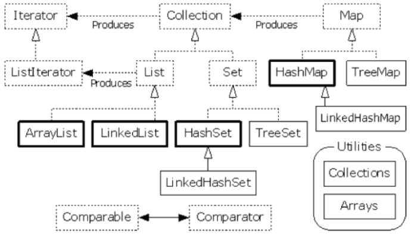
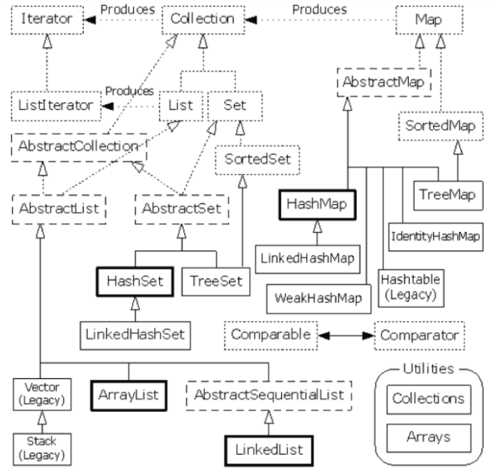

#### 学习 Java 容器类目标

1.了解容器类特性（并发安全、数据结构、有序否、可重复否、可为null否等）

2.了解容器类底层实现 ==> 辅助理解特性

3.学习容器工具类使用方式、和底层结构 ==> 高效使用、少犯错

#### 容器框架

1.集合接口 Collection 下图虚线矩形 -- 6个

2.抽象类 Abstract 对集合的部分实现、可扩展 长许线矩形 -- 5个

3.实现类 实线矩形 -- 8个

## 参考：

