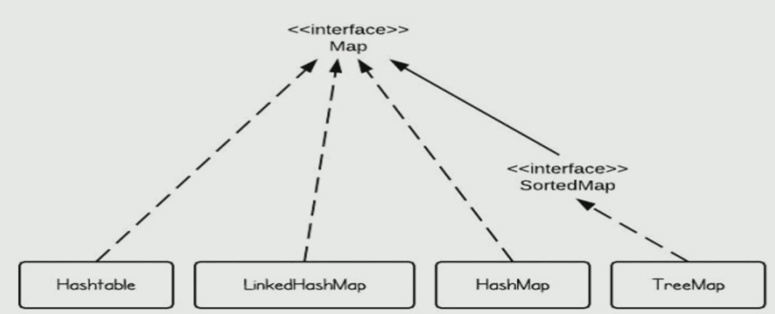
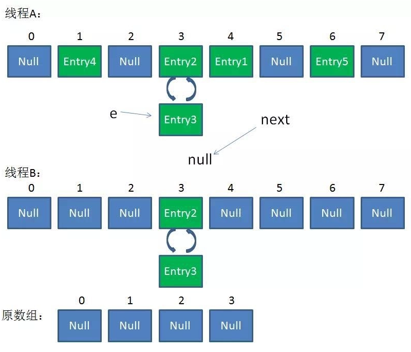
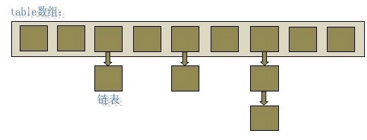
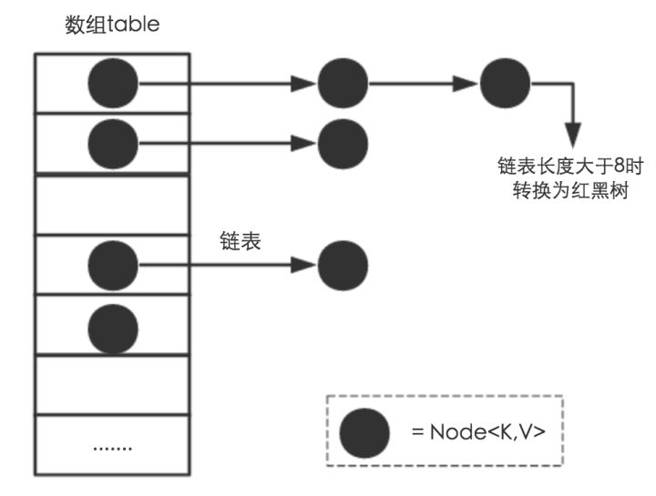

#### Map 映射

Map(key,value) key间值必须唯一，又称**键值对**，如下是 Java 几个主要的 Map 实现类。




#### HashMap 非同步 无序

##### 1.非同步：在并发环境下使用 HashMap 容易出现死循环  

​	容量大于 总量负载因子 发生**扩容**时会出现**环形链表**   
​	**并发**场景发生**扩容**，调用 resize() 方法里的 rehash() 时，容易出现**环形链表**  
这样当获取一个不存在的 key 时，计算出的 index 正好是环形链表的下标时就会出现死循环,如下

```java
final HashMap<String, String> map = new HashMap<String, String>(2);
for (int i = 0; i < 10000; i++) {
    new Thread(new Runnable() {
        @Override
        public void run() {
            map.put(UUID.randomUUID().toString(), "");
        }
    }).start();
}
```

- 环形链表原因：

  1.resize 是将 old 数据 **copy** 到新空间  
  2.多 Threads 同时 put，觉得内存不够，**同时**执行 **resize**  
  3.HashMap 扩容时，会改变链表中的元素的顺序，将元素从链表头部插入

- 并发场景下出现死循环
   多Threads同时put,同时调用了 **resize** ,可能导致循环链表，后面get的时候，会死循环

  - [ ] 这里没有理解的特清晰，2020年12月11日  

    [Blog 参考一](https://blog.csdn.net/sl1202/article/details/108218801)
    [Blog 参考二](https://blog.csdn.net/xuefeng0707/article/details/40797085?utm_medium=distribute.pc_relevant.none-task-blog-BlogCommendFromMachineLearnPai2-1.nonecase&amp;depth_1-utm_source=distribute.pc_relevant.none-task-blog-BlogCommendFromMachineLearnPai2-1.nonecase)



==>所以 HashMap，只能在**单线程**中，并且尽量的预设容量，尽可能的减少扩容。


##### 2.数据结构

1.数组：连续内存，占内存严重，空间复杂度很大，二分查找O(1)，寻址容易，插入和删除困难 

2.链表：离散存储，占内存宽松，空间复杂度很小 O(N)，寻址难，插入容易

数组 + 链表：容量     **capacity**  默认16，负载因子 **factor** 默认 0.75f，元素数量 **size**





##### 3.操作方法解析

1.put() 

1.会将传入的 Key 做 hash 运算计算出 hashcode,然后根据数组长度取模计算出在数组中的 index 下标  
2.计算中**位运算**比取模运算效率高的多，所以 HashMap 规定数组的长度为 2^n 。这样用 2^n - 1 做位运算  
	与取模效果一致，并且效率还要高出许多    
3.数组的长度有限，所以难免会出现不同的 Key 通过运算得到的 index 相同，这种情况可以利用链表来解决，  
	HashMap 会在 table[index]处形成链表，采用**头插法**将数据插入到链表中

2.get()

将传入的 Key 计算出 index，如果该位置上是一个链表就需要遍历整个链表，通过 key.equals(k) 来找到对应的元素

3.iter 遍历方式

```java
Iterator<Map.Entry<String, Integer>> entryIterator = map.entrySet().iterator();
while (entryIterator.hasNext()) {
    Map.Entry<String, Integer> next = entryIterator.next();
    System.out.println("key=" + next.getKey() + " value=" + next.getValue());
}
// 建议的方案 entry

Iterator<String> iterator = map.keySet().iterator();
while (iterator.hasNext()){
    String key = iterator.next();
    System.out.println("key=" + key + " value=" + map.get(key));
}
// 不太推荐先拿 key，再拿 value

map.forEach((key,value)->{
    System.out.println("key=" + key + " value=" + value);
});
// 此方法 jdk1.8后使用，通过外层遍历table, 内层遍历链表或红黑树
```

#### 

#### LinkedHashMap


#### ConcurrentHashMap


## 参考：

