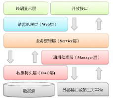

## 《Java 开发手册》 四、工程规约

##### 背景：

1. Alibaba Java 开发手册（有对外开放的），在地铁里看过很多遍了。
2. 这次梳理下，加上些自己补充的内容，拿出来溜溜，也夯实下自己的编程基础:smile:。
3. 另会将实际生成中碰到的不规范，不合适的情景备注进来，警告小辈:wink:

##### 级别：强制、推荐、参考
------

#### (一) 应用分层

1. 【推荐】图中默认上层依赖于下层，箭头关系表示可直接依赖，  
   如：开放接口层可以依赖于Web 层，也可以直接依赖于 Service 层，依此类推：    

   

   1. **开放接口**层：可直接封装 **Service 接口**暴露成 **RPC 接口**；通过 Web 封装成 **http 接口**；  
            网关控制层等。
   2. **终端显示**层：各个端的模板渲染并执行显示层。当前主要是 **velocity** 渲染，**JS** 渲染，**JSP** 渲
      染，**移动端展**示层等。
   3. **Web** 层：主要是对**访问控制**进行转发，各类基本参数校验，或者不复用的业务简单处理等。
   4. **Service** 层：相对具体的**业务逻辑**服务层。
   5. **Manager** 层：**通用业务**处理层，它有如下特征：
      - 对**第三方平台**封装的层，预处理返回结果及转化异常信息；
      - 对 Service 层**通用能力的下沉**，如缓存方案、中间件通用处理；
      - 与 DAO 层交互，对 **DAO 的业务通用能力**的封装。
   6. **DAO** 层：**数据访问层**，与底层 Mysql、Oracle、Hbase、OB 进行数据交互。

   
   
1. 【参考】分层异常处理规约

   - 在 **DAO** 层，产生的异常类型有很多，无法用细粒度异常进行catch，使用 catch(Exception e)方式，并 throw new DaoException(e)，不需要打印日志。
   - 因为日志在 **Manager / Service** 层一定需要捕获并打到日志文件中去，如果同台服务器再打日志，
      浪费性能和存储。  
      在 **Service** 层出现异常时，必须记录日志信息到磁盘，尽可能带上参数信息，相当于保护案发现场。  
      如果 **Manager** 层与 Service 同机部署，日志方式与 DAO 层处理一致。  
      如果是单独部署，则采用与 Service 一致的处理方式。  
   - **Web** 层绝不应该继续往上抛异常，因为已经处于顶层，无继续处理异常的方式，如果意识到这个异常将导致页面无法正常渲染，那么就应该直接跳转到友好错误页面，尽量加上友好的错误提示信息。
   - **开放接口**层要将异常处理成错误码和错误信息方式返回。    

   

1. 【参考】分层领域模型规约： 

   - **DO**（Data Object）：与数据库表结构一一对应，通过 DAO 层向上传输数据源对象。
   - **DTO**（Data Transfer Object）：数据传输对象，**Service 和 Manager** 向外传输的对象。
   - **BO**（Business Object）：业务对象。可以由 Service 层输出的封装业务逻辑的对象。
   - **QUERY**：数据查询对象，各层接收上层的查询请求。  
     注：超过 2 个参数的查询封装，禁止使用 **Map** 类来传输。
   - **VO**（View Object）：显示层对象，通常是 Web 向模板渲染引擎层传输的对象。   

#### (二) 二方库规约

1. 【强制】定义 **GAV** 遵从以下规则：

   - **GroupID** 格式：com.{公司/BU }.业务线.[子业务线]，最多 4 级。
     说明：{公司/BU} 例如：alibaba/taobao/tmall/aliexpress 等 BU 一级；子业务线可选。
     正例：com.taobao.tddl 或 com.alibaba.sourcing.multilang
   - **ArtifactID** 格式：产品线名-模块名。语义不重复不遗漏，先到仓库中心去查证一下。
     正例：tc-client / uic-api / tair-tool
   - **Version**：详细规定参考下方。    

   

1. 【强制】二方库版本号命名方式：主版本号.次版本号.修订号

   -  **主版本**号：当做了不兼容的 API 修改，或者增加了能改变产品方向的新功能。
   - **次版本**号：当做了向下兼容的功能性新增（新增类、接口等）。
   - **修订**号：修复 bug，没有修改方法签名的功能加强，保持 API 兼容性。    

   

1. 【强制】线上应用不要依赖 **SNAPSHOT** 版本（安全包除外）；  
   正式发布的类库必须使用 RELEASE 版本号升级+1 的方式，且版本号不允许覆盖升级，必须去中央仓库进行查证。      
   说明：不依赖 SNAPSHOT 版本是保证应用发布的幂等性。另外，也可以加快编译时的打包构建。

   

1. 【强制】二方库的**新增或升级**，保持除功能点之外的其它 jar 包仲裁结果不变。如果有改变，必须明确评估和验证，建议进行 **dependency:resolve** 前后信息比对，如果仲裁结果完全不一致，那么通过 **ependency:tree** 命令，找出差异点，进行排除 jar 包。    

   
   
1. 【强制】二方库里可以定义**枚举类型**，**参数可以**使用枚举类型，但是接口**返回值不允许**使用枚举类型或者包含枚举类型的 POJO 对象。    

   
   
1. 【强制】依赖于一个二方库群时，必须定义一个统一版本变量，避免版本号不一致。   
说明：依赖 springframework-core,-context,-beans，它们都是同一个版本，可以定义一个变量来保存版本：${spring.version}，定义依赖的时候，引用该版本。  
   
   
   
1. 【强制】禁止在子项目的 pom 依赖中出现相同的 GroupId，相同的 ArtifactId，但是不同的 Version。    
说明：在本地调试时会使用各子项目指定的版本号，但是合并成一个 war，只能有一个版本号出现在最后的 lib 目录中。  
   曾经出现过线下调试是正确的，发布到线上出故障的先例。
   
   

1. 【推荐】工具类二方库已经提供的，尽量不要在本应用中编程实现。

   - **json** 操作： fastjson
   - **md5** 操作：commons-codec
   - 工具集合：**Guava** 包
   - 数组操作：**ArrayUtils**（org.apache.commons.lang3.ArrayUtils）
   - 集合操作：**CollectionUtils**  (org.apache.commons.collections4.CollectionUtils)
   - 除上面以外还有 NumberUtils、DateFormatUtils、DateUtils 等优先使用
   - org.apache.commons.lang3 这个包下的，不要使用 org.apache.commons.lang 包下面的。  
      原因是 commons.lang 这个包是从 JDK1.2 开始支持的所以很多 1.5/1.6 的特性是不支持的，例如：泛型。    

   

1. 【推荐】所有 pom 文件中的依赖声明放在 **<dependencies>** 语句块中，所有版本仲裁放在 **<dependencyManagement>** 语句块中。

   说明：  
   <dependencyManagement> 里只是声明版本，并不实现引入  
   因此子项目需要显式的声明依赖，version 和 scope都读取自父 pom。  
而所有声明在主 pom 的里的依赖都会自动引入，并默认被所有的子项目继承。    
   
   
   
1. 【推荐】 二方库尽量**不要有配置项**，最低限度不要再增加配置项。   

   
   
1. 【参考】为避免应用二方库的**依赖冲突**问题，二方库发布者应当遵循以下**原则**：

    - **精简可控**原则  
      移除一切不必要的 API 和依赖，只包含 Service API、必要的领域模型对象、Utils 类、常量、枚举等。    如果依赖其它二方库，尽量是 provided 引入，让二方库使用者去依赖具体版本号；无 log 具体实现，只依赖日志框架。
    - **稳定可追溯**原则  
      每个版本的变化应该被记录，二方库由谁维护，源码在哪里，都需要能方便查到。  
      除非用户主动升级版本，否则公共二方库的行为不应该发生变化。    

    

## 参考：

