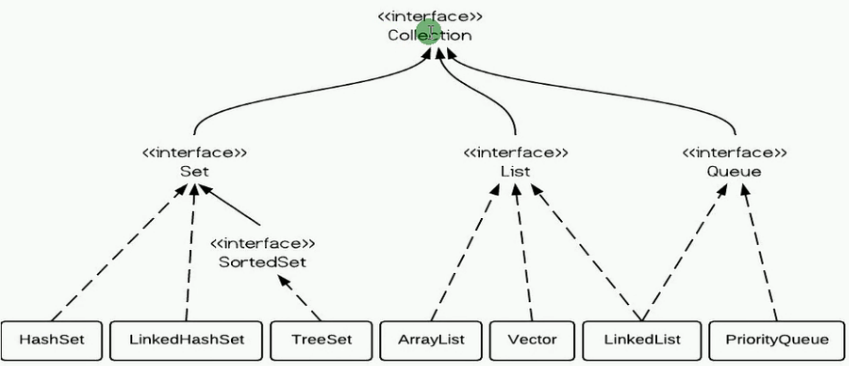

#### Collection 集合

1.元素是否重复标准是参照元素自身 equals 比较结果  
2.<Collection> 通常给它子接口实现提供2个标准构造方法:

- 无参构造-创建空 collection

- 有参构造-创建一个具有与其参数相同元素的新 collection  
  后者允许用户复制任何collection生成等效对象
- 集合传递**引用**

```
c.add(p);   p.setX(2);   syso(c);
集合存放了p的引用地址 p此时更改内容
集合c也会随之改变
```

此接口包含"破化性方法" 只可修改操作的collection的方法 collection 不支持该操作 则抛出UnsupportedException

特殊集合限制 - NullPointerException ClassCastException




##### 1,历史

 Java 集合框架是 java.util 包中提供的一系列工具, 为他程序处理对象组提供流标准的方式 诞生自1,2版本。

###### 1.2之前处理对象组：

- 1，数组 - 缺点：长度固定、数组中只能存放一种类型数据。  
  优点： 数组是所有数据的查找最快 最有效的方法

- 2，Vector Stack Properties -- Passed了  
  缺点：缺乏集中统一方式   
  Vector 和 Properties操作差别太大 不易扩展.

###### 1.2之后 集合框架 --- 对象组 标准处理

- 优点：性能提高----实现类特别多, 可以根据实际需要来选择; 每一个类都经过深度优化;  
  操作统一---- Collection  
  操作统一List Set, 使用的方法大体类似 实现了很多 规范的接口   
  	实现了 **扩展性** 提高 ---- 可以创建自己的集合类  
  	实现了 **Iterator** 接口 - 迭代器：提供访问元素的统一方法
- 不需考虑底层结构.映射类 
- 集合存的是一组单个数据 Map存一组成对数据-对象组 

##### 2, 常用接口 以及实现类介绍

```
Collection<E> - 是所有集合的父接口 Map不在Collection中
Set <- Collection 不允许出现相同元素 排它. 自创对象如何判断排它？？？
List <- Collection 以列表形式存储的集合

HashSet LinkedHashSet TreeSet SortedSet;
ArrayList LinkedList Vector;
LinkedList PriorityQueue;
```

##### 3, Iterator 迭代器

迭代器是用来遍历集合中的元素的，通过使用迭代器来遍历与数据分离;  
集合必须通过Iterable接口 并实现iterator()方法 返回一个迭代器对象;

- 遍历集合 - 迭代器 Iterator - 依靠多态   
  无需提供每种元素类型，遍历过程要遵循 问-取-删过程 / 删是非必要操作

- "#".equals(str); //建议形式  
  str.equals("#"); //不建议 -- 容易出现空指针异常  
  equals(Object); //不建议 除非你确定object是和你的类型相同

```java
hasNext(); next(); remove();
iterator it = c.iterator;
while(it.hasNext()){
	Object obj = it.next();
	使用
	it.remove()
} 
// = c.clean();
// 使用迭代器遍历时候，不能进行集合增删改操作，会报CurrentModifiedException 直接通过迭代器remove即可

while(it.hasNext()){
	System.out.println(it.next());
}
for-each 遍历集合 -所有集合都能用 for-each
for(String s;set){
	System.out.println(s);
}
Iterator it=list.iterator;
```

##### 4, 集合的选择

```
ArrayList -- 查询多 增删少 - 数组底层;
LinkedList -- 查询少 增删多 - 链表底层;
HashSet -- 无序;
TreeMap -- 自动排序
```

##### 5, Collections  -- 包装器 多态算法 - 工具类

由在 collection上操作/返回 collection 的静态方法组成，方法实现者 只需遵循规范本身 可用其他算法替代，包含破坏性算法。

- sort()      - 自然排序 - 从小到大 -用的少  里面元素必须能比大小否则报错 Comparable  
  实现comparable接口并实现int comparbleTo()-**合成**  
  务必指定comparable<T>泛型 -0+/大小  
  中文 英文 都是按照Unicode编码排序 - 不满足需求  
  重载 sort(c, comparator) - 继承 中介 比较器  // 无侵入

1，不要求元素实现接口 侵入小

2，元素自身有比较方法 不满足需求 可提供额外比较器

```java
class MyComparator implements Comparator<String>
{
	public int compare(String str1,String str2){
		xxxxx;
	} 
}
```

- 匿名内部类 -- 最佳方式 建议使用

```
Comparable - Comparator
compara(T o1) - compare(T o1,T o2) equals(obj)
```

- Collections 和 Collection 区别

  编程原则：最强耦合 最小侵入  

```
sort() 方法对 Point() 类产生了侵入，因为它要求 Point 实现Comparable接口 并改写代码.   
改写代码越多 入侵越大 越不利于扩展性
```

##### 6, 集合、数组  

- Collection ==> Array

​	Object[] array = c.**toArray**(); // 无参不常用-Collection  
​	String[] strArray = c.toArray(new String[1]) //1--数组长度  
​	new String[1] 长度给短了系统就自己创一个合适的，长了没关系 // 不建议使用 

- Array ==> Collection

  数组转集合 -- 只能转 List 不能 Set  
  用util中Arrays的static方法 asList() 实现  
  List<Integer> list = Arrays.asList(array);  此list代表的还是原array数组 如操作list.add()  
  对集合的操作就是对原数组的操作，可结合addALL() 来一个新集合来实施各种操作

- Collection 构造方法  
  //----复制构造器  
  List<String> list1 = new ArrayList<String>(list)  //同类型  
  Set<String> list2 = new HashSet<String>(list)    // 非同类型  会有数据缺失

String[] strArray = c.toArray(new String[c.size])  
E get(int index)  
E set(int index, E element) - 返回值为原位置元素 替换  
set当集合现有一个元素可执行，有异常 IndexOutOfBoundsException

```java
for (int i = 0; i < list.size(); i++) {
	String str = list.get(i);
	System.out.print(str);
}
String[] strArray = list.toArray(new String[list.size()]);
for (int i = 0; i < strArray.length; i++) {
	System.out.println(strArray[i]);
}

String[] strArray = list.toArray(new String[10]);
for (int i = 0; i < strArray.length; i++) {
	System.out.println(strArray[i]);
}
// 多出来的为null;
```


#### List Set Map 三个接口的区别

- List - 有序、可重复;  
  反复重复插入相等元素-实际是集合中，有多个索引指向这个元素.  
  Iterator + get(index i) -> 获取元素
- Set - 无序、不重复  
  不允许重复元素,指定是equals为false;  而非简单相同元素内部排序 , Iterator    
  HashSet - Hashcode算法进行存储, hashset 比较对象相等,先hashcode比->再equals比. hashset加不了多次相同对象。
- Map - 不能重复key Map.Entry. 


#### ArrayList Vector LinkedList 区别

- ArrayList & Vector 底层机制都是**数组**，允许直接按照序号索引元素。- 索引数据快,插入慢;

- Vector sychronized 线程**安全**, 通常性能上比ArrayList差

- LinkedList 使用双向链表,插入快,索引慢. 且 LL 是线程不安全的，  
  但提供了一些方法使得LinkedList可以当作 堆栈&队列来使用


#### HashMap & Hashtable

- HashMap - JDK1.2 -> 异步处理 性能较高，非线程安全 允许null

- HahsTable - JDK 1.0 -> 同步处理 性能较低  线程安全    不许null

HashMap 是 HashTable轻量级实现 非线程安全，对单一线程访问 效率比Hashtable高；  
HashMap entry & key 能 null Hashtable不行；   
HashMap去除table的contains()； 

是否线程同步不同hashmap需要外部提供同步；  
1，接口不同   
2，线程同步/安全与否   
3，值HashMap 可将null作key/value.


#### ArrayList & Vector

- 同：有续集合 动态数组 按索引取值 允许重复 

- 异：线程 -- 多线程用Vector; 

数据增长 -- Vector 2.0 ; LinkedList 1.5;


## 参考：

