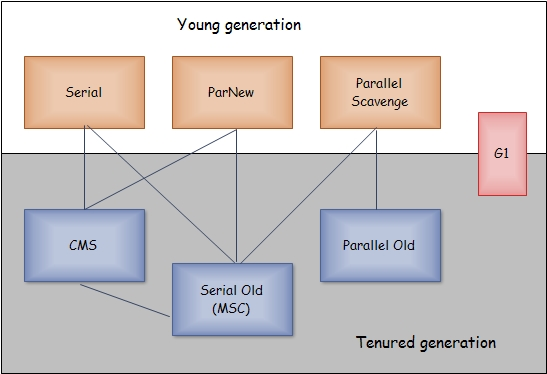

#### 1.GC 内存自动管理

1.栈帧随着入栈和出栈，实现了自动内存管理  
2.gc 主要集中于 **Java堆** 和 **方法区** 中



#### 2.对象存活判断

- 1.**引用计数**，无法解决循环引用

- 2.**可达性分析** Reachability Analysis

引用链，从GC Roots向下搜索，搜索路径为**引用链**  
一个对象不在任何一条引用链中，对象不可用，不可达

GC Roots：

```
1.虚拟机栈中引用的对象
2.方法区静态属性实体引用的对象
3.方法区常量引用的对象
4.本地方法栈中JNI引用的对象
```


#### 3.GC分代收集理论：

- **弱分代**假说（Weak Generational Hypothesis）：绝大多数对象都是朝生夕灭的

- **强分代**假说（Strong Generational Hypothesis）：熬过越多次垃圾收集过程的对象就越难以消亡

- **跨代引用**假说（Intergenerational Reference Hypothesis）：跨代引用相对于同代引用来说仅占极少数

1.Eden: 新创建对象存放这里(一些大对象特殊处理)  

Eden:From:To = 8:1:1   
Eden中对象经过第一次 MinorGC后。存活则1岁，进入From，然后在Survivor中年龄逐渐增加，一定程度后，移动到老年代  
YoungGeneration（80%以上朝生夕死，采用 Copying 算法）


2.gc开始时，To区空，Eden存活的全部到To区，From年龄大的到Old，没有的到To区，然后From清空，From和To交换角色


#### 4.常用收集器组合

| Yong                  | Old                | 说明                                                         |
| --------------------- | ------------------ | ------------------------------------------------------------ |
| **Serial**            | Serial   Old       | 全单线程，GC暂停所有应用线程                                 |
| Serial                | CMS +   Serial Old | **CMS **无需 STW,CMS 失败自动用 Serial   Old                 |
| **ParNew**            | CMS                | 默认 GC线程数为 CPU数量，可指定                              |
| ParNew                | Serial   Old       |                                                              |
| **Parallel Scavenge** | Serial   Old       | 关注可控吞吐量，尽可能提高CPU利用率，适用于持久后台运行的程序，不适合交互较多的程序 |
| Parallel  Scavenge    | Parallel   Old     |                                                              |
| **G1GC**              | G1GC               | 良好                                                         |

#### 5.垃圾收集算法

- MS: 标记、清除算法 **MS Mark-Sweep**,是最基础的收集算法  
  标记和清除效率都不高，会产生大量碎片空间

- Copy: 复制 **Copying** 内存分两块，一次用一半，清理时复制到另一半  
  实现简单，运行高效，但缩小了内存，持续复制长期生存对象降低效率

- MC: 标记、压缩 **MC Mark Compact**，标记后所有对象像一边移动，清理掉边界外内容 

- GC: **分代收集**，GC Generation Collection 基于假设绝大部分对象生命周期都非常短   
  Yong：每次都有大量对象死去，所以采用Copying复制算法   
  Old：对象存活率高，采用MS、MC都可以

#### 6.垃圾收集器 算法的具体实现

##### 1.串行 **Serial** GC  

最古老最稳定效率高的收集器，可能产生**较长的停顿**，只用一个线程去回收  
Yong、Old用Serial，Yong-Copying、Old-Compact，gc过程可能会产生服务暂停  
-XX:+UserSerialGC 
是默认垃圾收集器，适合单CPU


##### 2.并行 **ParNew**,是Serial多线程版本  

Yong 并行 + Copying、Old 串行+MC  
-XX;+UserParNewGC  
-XX:ParallelGCThreads=4 限制线程数量

**Parallel** Scavenge 类似 ParNew，更关注**系统吞吐量**，可通过参数打开自适应调节策略，虚拟机会检测系统运行情况，自动调整参数，提供**合适的停顿时间**，或**最大吞吐量**

Yong-Copying、Old MC  
Parelle Old，使用多线程和MC算法  
-XX:ParallelOldGC 使用Parallel收集器 + Old并行


##### 3.**CMS**  Concurrent Mark Sweep,  并发收集器  

以获取**最短停顿时间**为目标的收集器  
适合尤其注重服务的响应速度，希望系统停顿时间最短，给用户较耗体验上

```
1.初始标记 CMS initial mark，标记 GC Roots能直接关联的对象，速度快
2.**并发标记** CMS concurrent mark，GC Root Tracing过程
3.重新标记 CMS remark，修正并发期间，用户持续运作造成的变动部分
4.**并发清除** CMS concurrent sweep
```

 

1.2步骤仍需stop the world，   
2，4是耗时最长的步骤，但收集器线程和用户线程可以一起工作  
总体看用户线程和FC内存回收过程一起并发执行

优点：并发收集，**低停顿**  
缺点：产生大量碎片空间，并发阶段会降低吞吐量 

-XX:+**UseConcMarkSweepGC** 使用CMS收集器  
-XX:+ **UseCMSCompactAtFullCollection** Full GC后，进行一次碎片整理；

整理过程是独占的，会引起停顿时间变长

-XX:+**CMSFullGCsBeforeCompaction** 设置进行几次Full GC后，进行一次碎片整理  
-XX:**ParallelCMSThreads** 设定CMS的线程数量（一般情况约等于可用CPU数量）


##### 4.G1 收集器 Grabage First垃圾优先

```
-XX:+**UnlockExperimentalVMOptions** -XX:+UseG1GC #开启
-XX:MaxGCPauseMillis = 50 # 暂停时间目标
-XX:GCPauseIntervalMillis = 200 # 暂停间隔目标
-XX:+G1YongGenSize = 512m # 年轻代大小
-XX:SurvivorRatio =6 # 幸村区比例
```

1.空间整合，MC不会产生内存碎片  
2.可预测停顿，可指定消耗在垃圾收集上的时间不超过N毫秒，几乎达到实时Java(RTSJ)的垃圾收集器特征了   
3.G1将整个Java堆划分为大小相等的独立区域Region，Yong和Old不再是物理隔阂了，它们都是一部分Region的集合


G1新生代收集器和Parallel相似，Yong占用达到一定比例，开始GC, 老年代和CMS类似，Old收集会有短暂的停顿 

收集步骤：

- 1.标记 initial mark，会有 Stop-the-world-event，会出发一次普通 Mintor GC，对应GC log:GC pause(yong)(initial-mark)  
- 2.Root Region Scanning，会回收survivor区（存活到老年代），这一过程必须在yongGC前完成  
- 3.Concurrent Marking 在整个堆中进行并发标记，此过程可能会被yong GC打断, 并发标记会计算区域活性，活性为0，会立即回收


- 4.Remark 再标记，会有短暂停顿（STW），采用了比CMS中更快的初始快照算法：snapshot-at-the-beginning(SATB) 

- 5.Copy/Clean up,多线程清除失活对象，会有STW，G1将回收区域的存活对象copy到新区域，清除Remember Sets，并发清空回收区域并把它返回到空闲区域链表中


- 6.复制/清除过程后，回收区域的活性对象，以集中到如下的深蓝和深绿色区域


## 参考：

