## 为啥要写Blog？

#### 背景

先说说我的从业背景，再聊写Blog的出发点，对5~7年同业人事应该会略有所助吧。

从 **2015-2020** 经历了6年的开发历练。最开始并非IT专业出来的，工作1年后，通过自己学习入的行:smile:，发现自己还是相当适合这份工作的。

第一份工作进入的一家公司，也是家相当大的企业，一半公司自研的产品，一半替政府和企业做外包项目。  
第一个项目当时用的是 **HTML 前端**、**Java**、 **Spring MVC 后台**、**Oracle**、**Weblogic** 系列技术，内容做的是这个项目的二期、三期工程。然后呢，你懂的，就我一个人去对接需求、回来开发、测试、上线，写前端、写后端、写脚本、调服务器，自此以后***自夸全栈***，后来得知年少无知:upside_down_face:。 

第二个项目是家大企业的外包服务，我们是他们某一微服务的提供商，驻点、开发、熬夜，还是你懂的:rofl:。主要是 **Dubbo**、**Feign**、**Redis**、**RabbitMQ** 等，基本就是掉接口，基础技术架构、开发流程、沟通协调，因为是外包，接口文档很清晰（*因为要算钱*），除了要陪熬夜，其它都还好:smile:。       
其它也有大，有小的项目咯，反正都认真对待，认真做了。  

第二家金主爸爸，是一家教育企业，技术并不复杂，创业型企业，刚拿的A轮。进去之后做了技术主管，带了几号人，公司项目蛮多，但比较分散。使用的也是Spring，但不是完全采用的 Spring 原生技术栈，新接触和采用了 **dropwizard**(国外一款类Spring框架)、**Mongodb** 等。  
做了两年，小团队，事事得亲历亲为，离开这家进驻爸爸时候，也算是把公司内部系统都打通，连成产品线了，主要是内部系统居多，所以高并发、多线程等问题并不多。

第三家**金主爸爸**是我**自己**啦:clap:，此处应该有:clap:，花了我快 30w 的成本，尝试了下老板的痛苦与煎熬。其实就是自己设计和开发了一款产品，现在链接还在，少量用户，所以不怎么更新了。虽然没"钱途"，但毕竟是自己生的娃，低成本运行着吧，感兴趣童鞋可以在站找找，我有藏链接 :turkey:。

做这款产品，倒是从微服务、分布式、产品设计等角度整个锤炼了自己，可惜量没上来，也做不得数，定夺算个分布式小项目。后面打算将这段代经历，系统的梳理出Blog出来，给自己做个总结[链接等待中...]。

现在在一家互联网教育公司任职，希望给小朋友加加餐:bug::bug::bug:，哈哈。

#### 正题：为啥写Blog？

##### 一、还能为啥，因为我是敲字狂魔，从大学开始我就使用 onenote 来记录学习、工作、生活。  

- [ ]  等待我出一篇我使用 onenote 心得吧:smile:   

所以目前也积累了很多的笔记，供我自己使用没问题，现在想分享出来，锻炼自己美好大家，下面有我日常工作笔记，虽然可以联系我拿链接，但还是建议大家自己梳理自己的知识点，做自己的笔记，好消化。

- 记得在职时用 onenote 做公司笔记，一定要加密哦。

- 献上技术丑图若干。

**1.主人，您的微服务到啦**
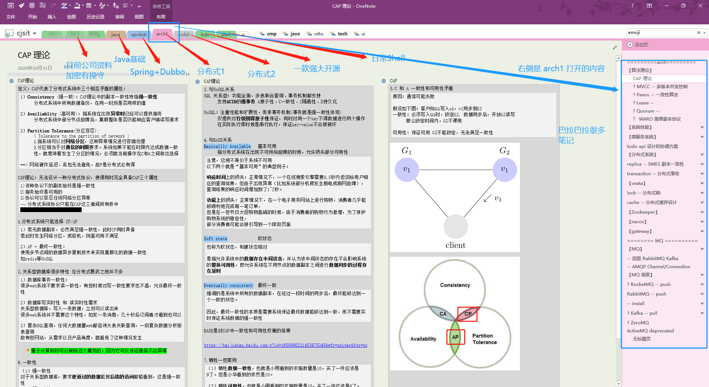

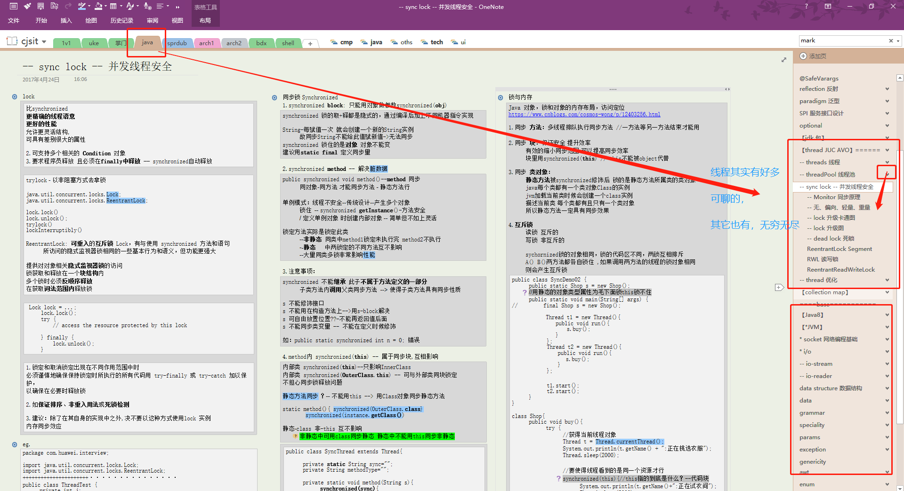

**2.老爷，该打打技术基础啦**
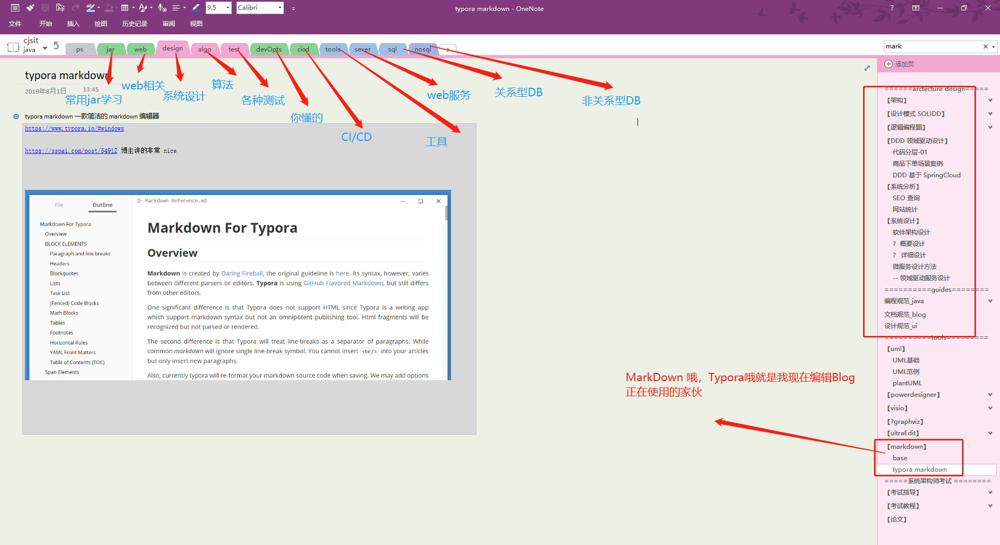

**3.为啥说，我们要回头学习**
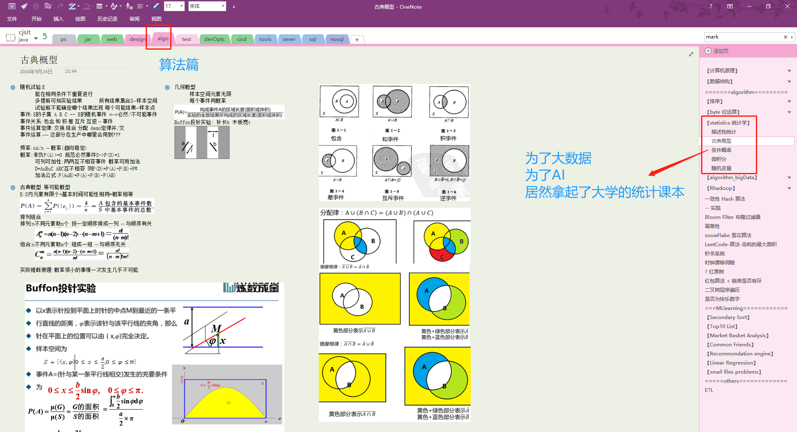

**4.当一个Python课老师的快乐**
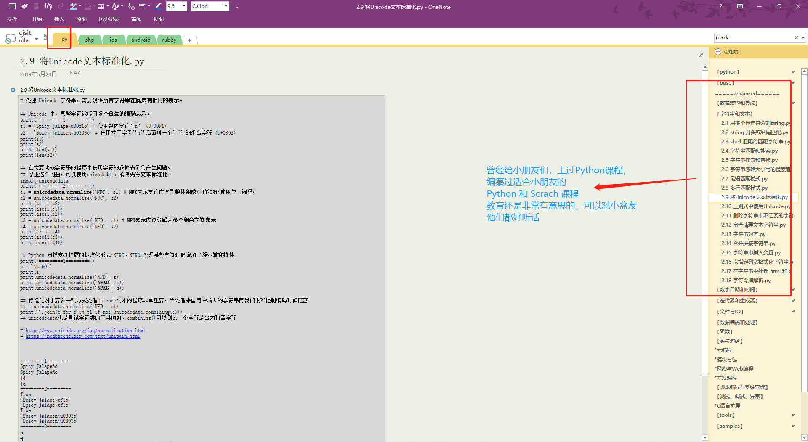

**5.大数据也很有趣**
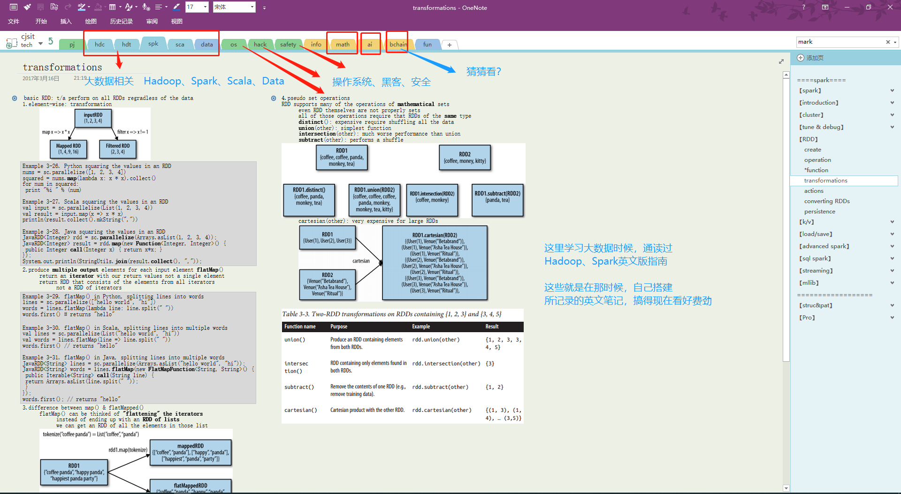

**6.想和我一起复习数学嘛**
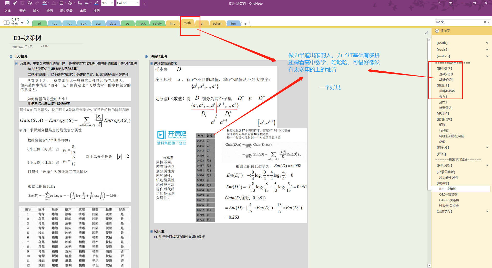

**7.为了和前端做朋友，好好学习前端**
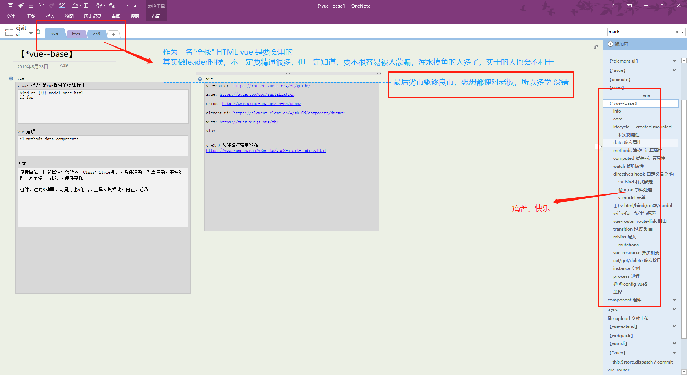

- 献上做技术，还要补课的其它内容若干痛苦

**8.不了解产品的程序员，不是产品好搭档**
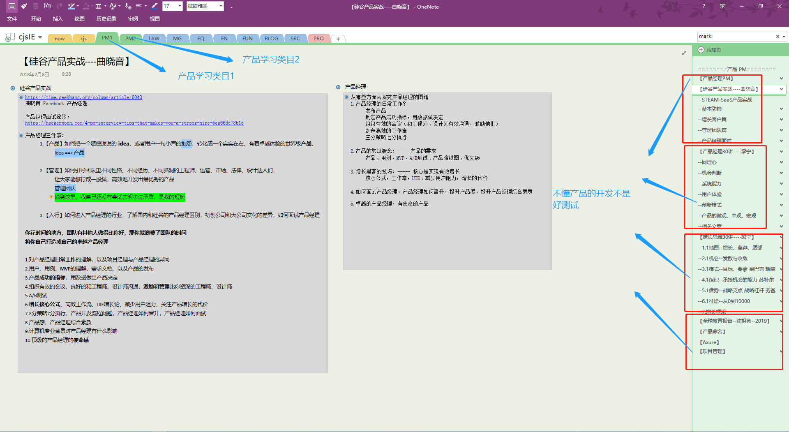

**9.30w买来的 Saas、营销学习过程,巴拉巴拉​**:cry:
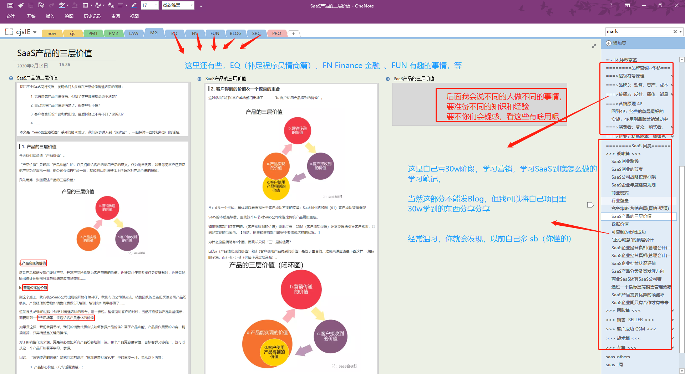

**10.程序员也要丰富多彩，努力涨EQ，要不和我一样单身 wang**
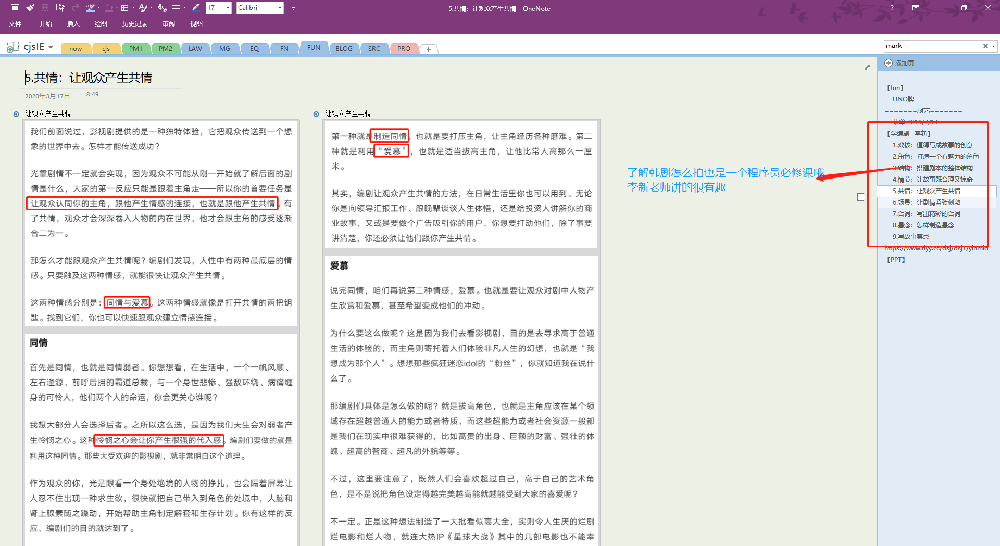

##### 二、什么值得传播

我以前很少写 Blog，因为常见的内容，还是官方手册最靠谱。  
写的不好也不敢坑人，所以前面就给自己写了上面图片那些，现在算是入行了，所以写些请大家指正。  
**经验+体会+思考+整理+传播**你值得拥有，当然也希望有大牛哥哥、姐姐们带带我，大牛弟弟妹妹也行。

##### 三、Blog 原则

- 不传播纯基础知识，这是文档手册的专长，希望大家都努力看文档和源码，我自己也是。
- 我个性是想做一件事情，一件有意义的事情，写程序也是，最终目标是做一个好项目，支撑一个好的事情。
- 如果有误导性经验，请各位老爷留个言，我想做知识的良心搬运工。
- 努力吧，骚年。

##### 四、版权
- 学习中难免会用到网上的一些截图、文档，尽量会做脚注，如发现有问题的，请联系我我更正或删除。

