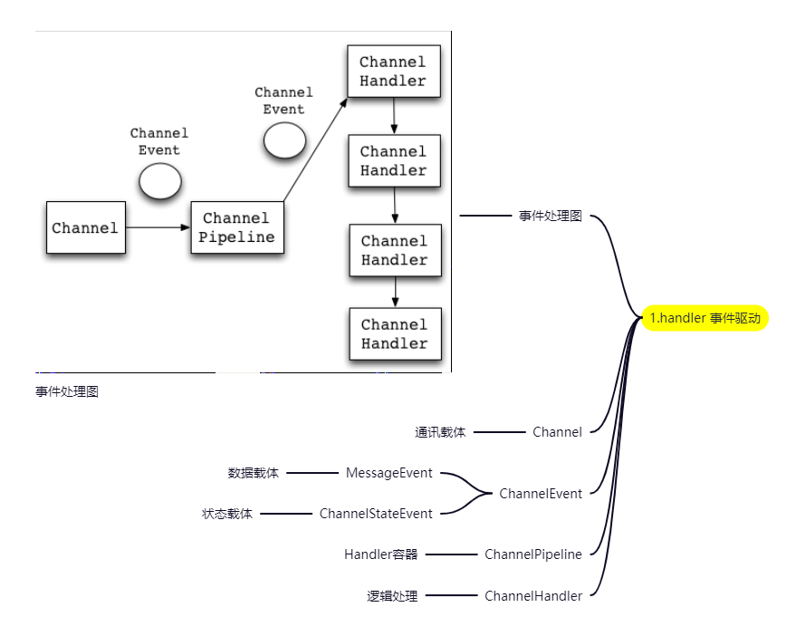
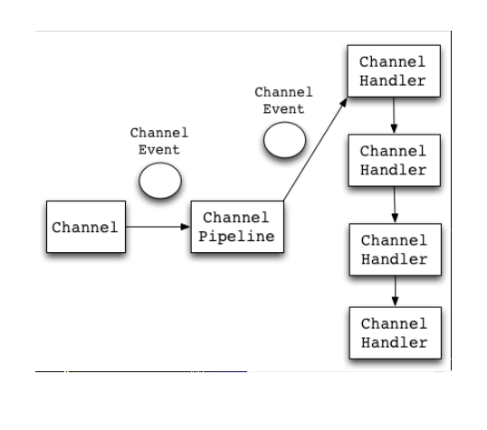
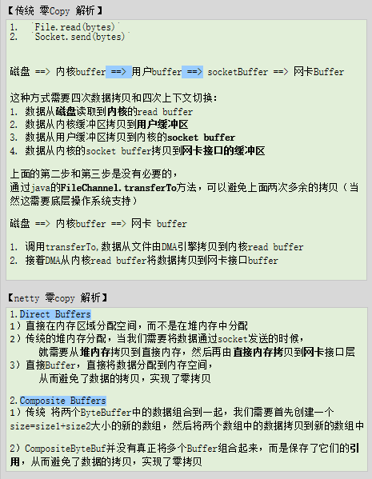
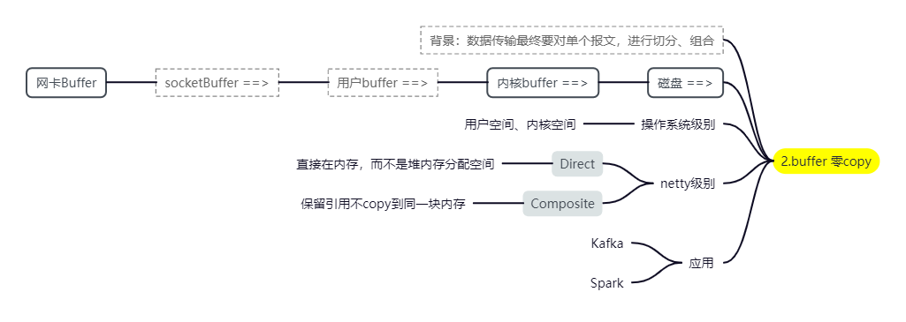
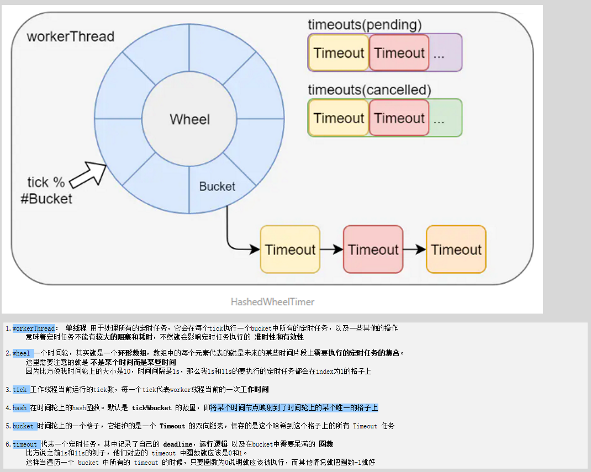
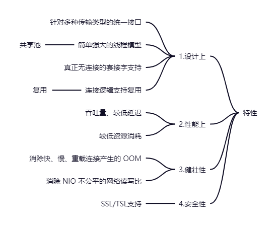

#### Socket Netty 思维脑图
<iframe id="embed_dom" name="embed_dom" frameborder="0" style="display:block;width:525px; height:245px;" src="https://www.processon.com/embed/61d9967ae0b34d1be7e3bb31"></iframe>

#### Netty
###### Reactor 机制
- [] Netty 的 Ractor 机制后续详细介绍，可参考另外的 Reactor 并发编程模型 Blog

###### Event Handler 事件驱动机制
- [] Netty 的 Event 机制

###### PipeLine

####### 零copy

###### WheelTimer 批量定时调度

###### Nagle算法
Nagle算法：收集一定数量的小数据，并打包传输
Netty里可以用setOption("tcpNoDelay", true)关掉它

- 1.化同步为异步的机制
- 2.解决数据传输的速率不对等以及不稳定的问题

#### Netty 特性

#### Netty 功能

