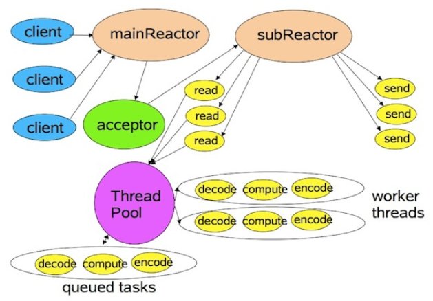
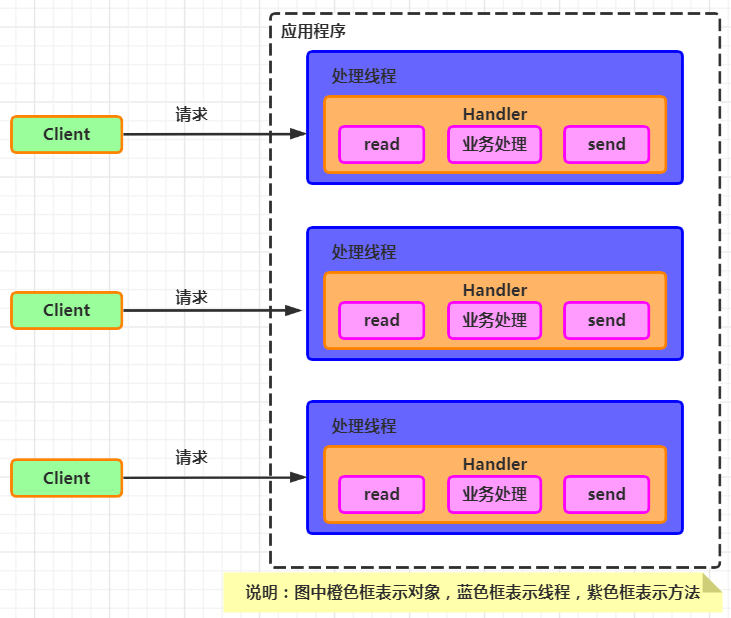

## Reactor
由一个不断等待和循环的单独进程（线程）来做这件事，	接受所有handler的注册，并负责先操作系统查询IO是否就绪，
在就绪后就调用指定handler进行处理，这个角色的名字就叫做 Reactor

- Reactor【同步IO】:  操作系统只负责通知IO就绪，具体的IO操作（例如读写）仍然是要在业务进程里阻塞的去做的
- Proactor【异步IO】: 操作系统将IO操作执行好（例如读取，会将数据直接读到内存buffer中），而handler只负责处理自己的逻辑，真正做到了IO与程序处理异步执行

### 优点
```aidl
响应快，不必为单个同步事件所阻塞，虽然Reactor本身依然是同步的

可以最大程度避免复杂的多线程及同步问题，并且避免多线程/进程的切换

扩展性好，可以方便通过增加Reactor实例个数充分利用CPU资源

复用性好，Reactor模型本身与具体事件处理逻辑无关，具有很高的复用性
```


- mainReactor 只有一个，负责响应client的连接请求，并建立连接，它使用一个NIO Selector
- subReactor  可以有一个或者多个，每个subReactor都会在一个独立线程中执行，并且维护一个独立的NIO Selector


### Reactor 与 IO多路复用
```aidl
1）I/O多路复用：多个连接共用一个阻塞对象(即下图中的ServiceHandler)，应用程序只需要在一个阻塞对象等待，无需阻塞等待所有连接，
	当某个连接有新的数据可以处理时，操作系统通知应用程序线程从阻塞状态返回，并将数据分发给对应的线程处理

2）基于线程池复用线程资源：不必再为每个连接创建线程，将连接完成后的业务处理任务交给线程池中的线程处理，处理完成后归还线程，
	同一个线程可以处理多个连接的业务，达到线程复用
```


```aidl
1.Connection Per Thread 模型： 为了解决同步阻塞问题，采用多线程处理并发，每一个连接用一个线程处理
	单个线程仍然是阻塞的，整体看是同步的
```



## 3种不同 Reactor
### 1.单 Reactor 单 thread
```aidl
1.Reactor对象通过select监控客户端请求事件，收到事件后通过Dispatch进行派遣

2.如果是建立连接请求事件，则由Acceptor通过accept处理连接请求，然后创建Handler对象处理连接完成后的后续业务处理
如果不是建立连接请求事件，则Reactor则会分发调用连接对应的Handler来响应

3.Handler会完成Read->业务处理->Send的完整业务逻辑
```

- 优点：简单、没有多线程问题
- 缺点：单线程无法发挥多 CPU 优势； 可靠性差：一个线程崩溃则服务崩溃


### 2.单 Reactor 多 thread
```aidl
1.Reactor对象通过select监控客户端请求，当请求事件达到后，通过dispatch派遣请求；

2.若是建立连接的事件，则通过Acceptor的accept处理连接请求，然后创建Handler事件来处理后续逻辑；
如果不是建立连接事件，则通过Reactor分发到连接对应的handler来处理；

3.handler只负责响应事件，不做具体的业务处理，通过read读取数据后，分发给worker线程池去处理业务；

4.worker线程池会分配独立的线程去完成真正的业务，并将结果返回给handler；

5.handler收到响应后，通过send方法将结果返回给client；
```

- 优点：充分利用多 CPU；线程池复用，减少线程本身消耗
- 缺点：Reactor 单线程运行，高并发容易成为瓶颈；多线程数据共享和访问比较复杂


### 3.多 主从 Reactor
```aidl
1.Reactor主线程MainReactor对象通过select监听连接事件，收到事件后，通过Acceptor处理事件；

2.当Accept处理连接事件后，MainReactor将连接分配给SubReactor；

3.subReactor将连接加入到连接队列进行监听，并创建handler进行各种事件处理；

4.当有新事件发生时，subReactor将调用对应的handler处理；

5.handler通过read读取数据，分发给后面的worker线程进行处理；
handler收到响应结果后，通过send发送给client；
```

- 优点：
  - 主线程与子线程的数据交互简单职责明确，主线程只需要接收新连接，子线程完成后续的业务处理
  - 可以通过扩展多个Reactor子线程的方式来减小单个子线程的压力，提高并发处理能力
- 案例：
  - Netty就是在主从Reactor多线程模型的基础上进行了一定的改进
  - Kafka的网络架构设计也采用了这种主从Reactor多线程的模型

